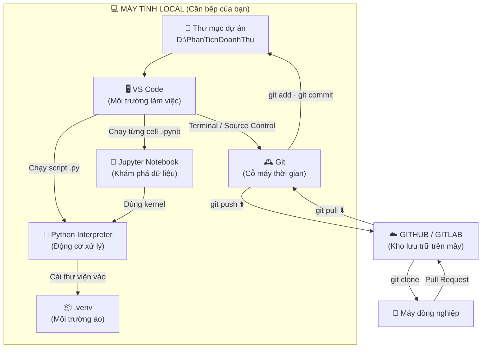
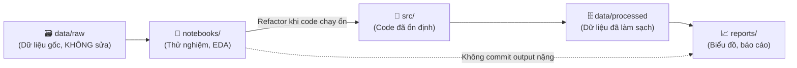
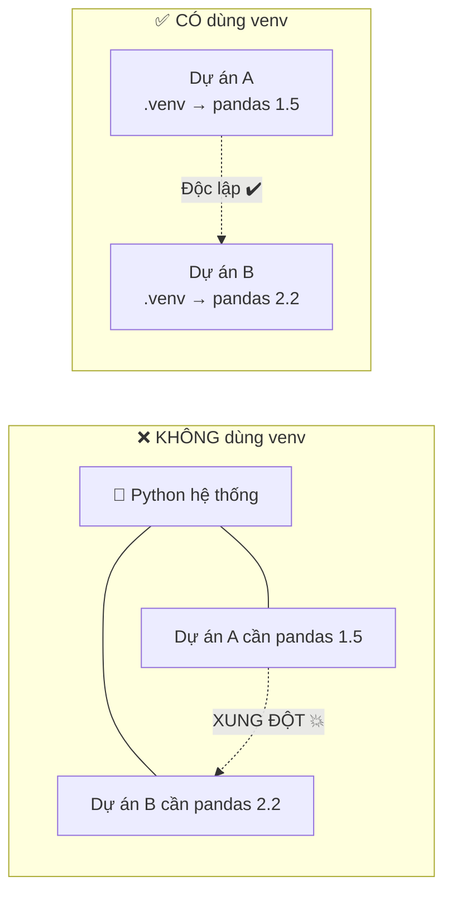
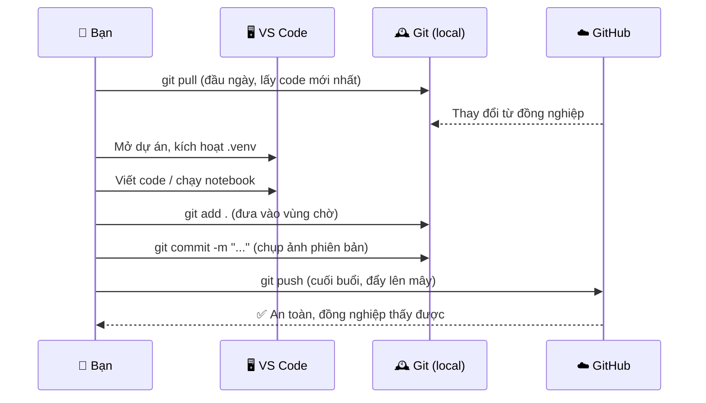
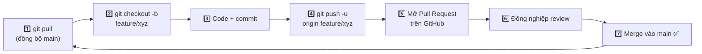

# 📊 Dự án Phân tích Dữ liệu — Sổ tay Quy trình làm việc

> Tài liệu này mô tả toàn bộ "hệ sinh thái" công cụ của một dự án Data Science chạy trên máy local:
> **VS Code · Python · Jupyter Notebook · Git · GitHub/GitLab**.
> Dùng làm README cho dự án, hoặc làm tài liệu onboarding cho thành viên mới.

---

## 📑 Mục lục

1. [Tổng quan kiến trúc](#1-tổng-quan-kiến-trúc)
2. [Sơ đồ dạng cây (cấu trúc thư mục)](#2-sơ-đồ-dạng-cây-cấu-trúc-thư-mục)
3. [Vai trò từng thành phần](#3-vai-trò-từng-thành-phần)
4. [Cài đặt môi trường (từ số 0)](#4-cài-đặt-môi-trường-từ-số-0)
5. [Virtual Environment — tại sao bắt buộc](#5-virtual-environment--tại-sao-bắt-buộc)
6. [Vòng đời một ngày làm việc](#6-vòng-đời-một-ngày-làm-việc)
7. [Cheat sheet lệnh Git](#7-cheat-sheet-lệnh-git)
8. [Quy ước commit & nhánh](#8-quy-ước-commit--nhánh)
9. [File .gitignore mẫu cho Data Science](#9-file-gitignore-mẫu-cho-data-science)
10. [Làm việc nhóm & giải quyết xung đột](#10-làm-việc-nhóm--giải-quyết-xung-đột)
11. [Xử lý sự cố thường gặp](#11-xử-lý-sự-cố-thường-gặp)
12. [Bước tiếp theo: nâng cấp quy trình](#12-bước-tiếp-theo-nâng-cấp-quy-trình)

---

## 1. Tổng quan kiến trúc

### 1.1. Sơ đồ tổng thể



### 1.2. Luồng dữ liệu & luồng code



> 💡 **Nguyên tắc vàng:** Notebook để *khám phá*, file `.py` để *sản xuất*.
> Khi một đoạn code trong notebook đã chạy ổn định và dùng lại nhiều lần → chuyển nó sang `src/`.

---

## 2. Sơ đồ dạng cây (cấu trúc thư mục)

Dùng sơ đồ này nếu trình đọc Markdown của bạn không hỗ trợ Mermaid.

```text
☁️ TẦNG CLOUD (Lưu trữ · Backup · Chia sẻ)
└── GitHub / GitLab
      ↑ git push    — đẩy commit từ máy lên mây
      ↓ git pull    — kéo thay đổi từ mây về máy
      ⤢ git clone   — tải toàn bộ dự án về máy mới
══════════════════════════════════════════════════
💻 TẦNG LOCAL (Nơi bạn làm việc trực tiếp)
└── 📁 PhanTichDoanhThu/              ← Thư mục gốc dự án (Git repo)
      │
      ├── 📦 .git/                    ← Trái tim của Git. KHÔNG bao giờ sửa tay.
      ├── 📦 .venv/                   ← Môi trường ảo Python (không commit)
      ├── 📝 .gitignore               ← Bộ lọc chặn file rác / dữ liệu nặng
      ├── 📖 README.md                ← Chính là file này
      ├── 📋 requirements.txt         ← Danh sách thư viện cần cài
      │
      ├── 🗃️ data/
      │     ├── raw/                  ← Dữ liệu gốc (read-only, thường không commit)
      │     └── processed/            ← Dữ liệu đã làm sạch
      │
      ├── 📓 notebooks/
      │     ├── 01_kham_pha.ipynb     ← EDA: xem dữ liệu có gì
      │     └── 02_mo_hinh.ipynb      ← Thử nghiệm mô hình
      │
      ├── 🐍 src/
      │     ├── __init__.py
      │     ├── lam_sach.py           ← Hàm xử lý dữ liệu
      │     └── ve_bieu_do.py         ← Hàm vẽ biểu đồ
      │
      ├── 📈 reports/                 ← Biểu đồ, file Excel, PDF xuất ra
      │
      └── 🖥️ .vscode/                 ← Cấu hình riêng cho VS Code
            └── settings.json
```

---

## 3. Vai trò từng thành phần

| Thành phần | Ví von | Vai trò thực tế | Nằm ở đâu |
| :--- | :--- | :--- | :--- |
| **🖥️ VS Code** | Bàn bếp | Trình soạn thảo. Mở thư mục dự án, viết code, chạy terminal, commit Git bằng giao diện. | Cài trên máy |
| **🐍 Python** | Bếp gas | Trình thông dịch. Thực thi code, xử lý dữ liệu. VS Code chỉ *gọi* nó. | Cài trên máy (hoặc trong `.venv`) |
| **📓 Jupyter Notebook** | Sổ tay nháp | Chạy code theo từng ô (cell), thấy kết quả và biểu đồ ngay bên dưới. Lý tưởng cho EDA. | File `.ipynb`, chạy trong VS Code |
| **📦 .venv** | Tủ đồ riêng | Môi trường ảo. Cô lập thư viện của dự án này với các dự án khác. | Trong thư mục dự án |
| **🕰️ Git** | Cỗ máy thời gian | Ghi lại lịch sử thay đổi. Cho phép quay về bất kỳ phiên bản nào trong quá khứ. | Cài trên máy, dữ liệu nằm trong `.git/` |
| **📁 Thư mục dự án** | Nhà kho | Chứa mọi thứ: code, dữ liệu, cấu hình. Git theo dõi toàn bộ thư mục này. | Ổ cứng máy bạn |
| **📝 .gitignore** | Bộ lọc rác | Khai báo những file Git phải **bỏ qua**: dữ liệu nặng, `.venv`, cache, mật khẩu. | Gốc thư mục dự án |
| **☁️ GitHub/GitLab** | Nhà kho trên mây | Backup, chia sẻ, review code, làm việc nhóm. Máy hỏng vẫn còn code. | Internet |

---

## 4. Cài đặt môi trường (từ số 0)

### Bước 1 — Cài Python

| Hệ điều hành | Cách cài |
| :--- | :--- |
| Windows | Tải từ [python.org](https://www.python.org/downloads/) → ✅ **tick "Add Python to PATH"** |
| macOS | `brew install python` |
| Ubuntu | `sudo apt install python3 python3-venv python3-pip` |

Kiểm tra:
```bash
python --version      # Windows
python3 --version     # macOS / Linux
```

### Bước 2 — Cài Git

| Hệ điều hành | Cách cài |
| :--- | :--- |
| Windows | Tải [Git for Windows](https://git-scm.com/download/win) |
| macOS | `brew install git` (hoặc `xcode-select --install`) |
| Ubuntu | `sudo apt install git` |

Khai báo danh tính (chỉ làm 1 lần duy nhất trên máy):
```bash
git config --global user.name "Nguyen Van A"
git config --global user.email "email_dung_tren_github@example.com"
git config --global init.defaultBranch main
```

### Bước 3 — Cài VS Code + Extensions

Tải tại [code.visualstudio.com](https://code.visualstudio.com/), sau đó cài các extension:

| Extension | Publisher | Công dụng |
| :--- | :--- | :--- |
| **Python** | Microsoft | Hiểu cú pháp, gợi ý code, chọn interpreter |
| **Jupyter** | Microsoft | Chạy file `.ipynb` ngay trong VS Code |
| **GitLens** | GitKraken | Xem ai sửa dòng nào, lúc nào |
| **Ruff** hoặc **Black Formatter** | Astral / Microsoft | Tự động format code cho đẹp |
| **Rainbow CSV** | mechatroner | Xem file CSV có màu, dễ đọc |

### Bước 4 — Khởi tạo dự án

```bash
# 1. Tạo và vào thư mục
mkdir PhanTichDoanhThu && cd PhanTichDoanhThu

# 2. Mở VS Code ngay tại đây
code .

# 3. Tạo môi trường ảo
python -m venv .venv

# 4. Kích hoạt môi trường ảo
.venv\Scripts\activate        # Windows (PowerShell / CMD)
source .venv/bin/activate     # macOS / Linux

# 5. Cài thư viện cơ bản
pip install pandas numpy matplotlib seaborn jupyter openpyxl

# 6. Ghi lại danh sách thư viện
pip freeze > requirements.txt

# 7. Khởi tạo Git
git init
git add .
git commit -m "chore: khởi tạo dự án"
```

### Bước 5 — Kết nối lên GitHub

```bash
# Tạo repo rỗng trên github.com trước, rồi:
git remote add origin https://github.com/TEN_CUA_BAN/PhanTichDoanhThu.git
git branch -M main
git push -u origin main
```

> Từ lần sau chỉ cần gõ `git push` là đủ (nhờ cờ `-u` đã ghi nhớ).

---

## 5. Virtual Environment — tại sao bắt buộc



**Quy tắc ghi nhớ:**

- Mỗi dự án = một `.venv` riêng.
- `.venv` **không bao giờ** được commit lên Git (đã có trong `.gitignore`).
- Thứ được commit là `requirements.txt` — người khác chỉ cần `pip install -r requirements.txt` là tái tạo được y hệt môi trường của bạn.
- Trong VS Code, nhấn `Ctrl + Shift + P` → `Python: Select Interpreter` → chọn cái có chữ `.venv`.

---

## 6. Vòng đời một ngày làm việc



### Checklist hàng ngày

**☀️ Đầu ngày**
- [ ] `git pull` để lấy thay đổi mới nhất
- [ ] Kích hoạt `.venv`
- [ ] `git checkout -b feature/ten-tinh-nang` nếu bắt đầu việc mới

**⚙️ Trong lúc làm**
- [ ] Commit nhỏ và thường xuyên (mỗi khi hoàn thành 1 ý trọn vẹn)
- [ ] `git status` trước khi `git add` để biết mình đang thêm gì

**🌙 Cuối ngày**
- [ ] `pip freeze > requirements.txt` nếu có cài thư viện mới
- [ ] Commit nốt phần dang dở: `git commit -m "wip: đang làm dở phần X"`
- [ ] `git push` — **quan trọng nhất**, đừng để code chỉ nằm trên máy

---

## 7. Cheat sheet lệnh Git

### 7.1. Nhóm lệnh xem trạng thái

| Lệnh | Ý nghĩa |
| :--- | :--- |
| `git status` | File nào đã sửa, file nào đang chờ commit |
| `git log --oneline --graph --all` | Xem lịch sử commit dạng cây |
| `git diff` | Xem chính xác đã sửa những dòng nào |
| `git diff --staged` | Xem những gì sắp được commit |

### 7.2. Nhóm lệnh lưu phiên bản

| Lệnh | Ý nghĩa |
| :--- | :--- |
| `git add ten_file.py` | Đưa 1 file vào vùng chờ |
| `git add .` | Đưa **tất cả** thay đổi vào vùng chờ |
| `git commit -m "nội dung"` | Chốt một phiên bản |
| `git commit --amend` | Sửa lại commit vừa rồi (khi lỡ gõ sai message) |

### 7.3. Nhóm lệnh đồng bộ với Cloud

| Lệnh | Ý nghĩa |
| :--- | :--- |
| `git clone <url>` | Tải toàn bộ dự án về máy |
| `git pull` | Kéo thay đổi mới nhất từ mây về |
| `git push` | Đẩy commit của mình lên mây |
| `git fetch` | Chỉ *xem* có gì mới, chưa gộp vào code |

### 7.4. Nhóm lệnh nhánh (branch)

| Lệnh | Ý nghĩa |
| :--- | :--- |
| `git branch` | Liệt kê các nhánh |
| `git checkout -b ten-nhanh` | Tạo và chuyển sang nhánh mới |
| `git switch main` | Quay về nhánh chính |
| `git merge ten-nhanh` | Gộp nhánh vào nhánh hiện tại |

### 7.5. Nhóm lệnh "cứu hỏa" ⚠️

| Lệnh | Ý nghĩa | Mức nguy hiểm |
| :--- | :--- | :--- |
| `git restore ten_file.py` | Hoàn tác thay đổi **chưa** add | 🟡 Mất phần sửa chưa lưu |
| `git restore --staged ten_file.py` | Gỡ file khỏi vùng chờ | 🟢 An toàn |
| `git reset --soft HEAD~1` | Hủy commit cuối, **giữ** nguyên code | 🟢 An toàn |
| `git reset --hard HEAD~1` | Hủy commit cuối, **xóa luôn** code | 🔴 Mất dữ liệu |
| `git revert <mã-commit>` | Tạo commit mới để đảo ngược commit cũ | 🟢 An toàn nhất khi đã push |
| `git stash` / `git stash pop` | Cất tạm thay đổi rồi lấy lại sau | 🟢 An toàn |

> 🔴 **Đừng dùng `--hard` khi chưa chắc chắn.** Với code đã push lên mây, luôn ưu tiên `git revert`.

---

## 8. Quy ước commit & nhánh

### 8.1. Conventional Commits

Cấu trúc: `<loại>: <mô tả ngắn, viết thường, không dấu chấm cuối>`

| Loại | Dùng khi |
| :--- | :--- |
| `feat` | Thêm tính năng / phân tích mới |
| `fix` | Sửa lỗi |
| `data` | Thêm hoặc cập nhật dữ liệu |
| `docs` | Sửa README, chú thích |
| `refactor` | Dọn code, không đổi hành vi |
| `chore` | Việc lặt vặt: cấu hình, thư viện |
| `wip` | Đang làm dở (chỉ dùng trên nhánh cá nhân) |

**Ví dụ tốt:**
```
feat: them bieu do doanh thu theo quy
fix: sua loi chia cho 0 khi tinh ty le tang truong
data: cap nhat du lieu ban hang thang 9
refactor: tach ham lam sach sang src/lam_sach.py
```

**Ví dụ nên tránh:** `update`, `sửa tí`, `asdfgh`, `final_v2_final_that`.

### 8.2. Đặt tên nhánh

```
main                        ← Nhánh chính, luôn phải chạy được
├── feature/phan-tich-quy4  ← Tính năng mới
├── fix/loi-doc-file-excel  ← Sửa lỗi
└── exp/thu-mo-hinh-arima   ← Thử nghiệm
```

---

## 9. File .gitignore mẫu cho Data Science

Tạo file `.gitignore` ở thư mục gốc, dán nội dung sau:

```gitignore
# ===== Môi trường ảo =====
.venv/
venv/
env/

# ===== Python cache =====
__pycache__/
*.py[cod]
*.egg-info/
.pytest_cache/
.ruff_cache/

# ===== Jupyter =====
.ipynb_checkpoints/
*-checkpoint.ipynb

# ===== Dữ liệu nặng (GitHub giới hạn 100 MB/file) =====
data/raw/
data/processed/
*.csv
*.xlsx
*.parquet
*.db
*.sqlite3
# Nếu muốn giữ 1 file mẫu nhỏ, ghi đè bằng dấu !
!data/raw/mau_du_lieu_nho.csv

# ===== Kết quả xuất ra =====
reports/*.png
reports/*.pdf
models/*.pkl

# ===== Bí mật — TUYỆT ĐỐI không commit =====
.env
*.key
secrets.json
credentials.json

# ===== Hệ điều hành & IDE =====
.DS_Store
Thumbs.db
.vscode/*
!.vscode/settings.json
!.vscode/extensions.json
.idea/
```

> ⚠️ **Lưu ý:** `.gitignore` chỉ có tác dụng với file **chưa từng** được Git theo dõi.
> Nếu đã lỡ commit file nặng: `git rm --cached ten_file.csv` rồi commit lại.

---

## 10. Làm việc nhóm & giải quyết xung đột

### 10.1. Luồng Pull Request



### 10.2. Khi gặp conflict

Git sẽ chèn dấu hiệu vào file:

```python
<<<<<<< HEAD
doanh_thu = df["revenue"].sum()
=======
doanh_thu = df["Revenue"].sum()
>>>>>>> feature/sua-ten-cot
```

**Cách xử lý:**
1. Mở file trong VS Code — sẽ có nút `Accept Current` / `Accept Incoming` / `Accept Both`.
2. Chọn phiên bản đúng, **xóa hết** các dòng `<<<<<<<`, `=======`, `>>>>>>>`.
3. Chạy thử code xem còn chạy được không.
4. `git add .` → `git commit` → `git push`.

### 10.3. Conflict trong file .ipynb — vấn đề đặc thù

File notebook thực chất là JSON, chứa cả output và metadata → **cực kỳ dễ conflict**.

**Giải pháp:**

| Cách | Mô tả |
| :--- | :--- |
| Xóa output trước khi commit | Trong VS Code: `Clear All Outputs` trước khi lưu |
| Dùng `nbstripout` | `pip install nbstripout && nbstripout --install` — tự động xóa output khi commit |
| Chia notebook nhỏ | Mỗi người làm một notebook riêng, tránh sửa chung một file |
| Chuyển logic sang `src/` | Code trong `.py` merge dễ hơn nhiều |

---

## 11. Xử lý sự cố thường gặp

| Triệu chứng | Nguyên nhân | Cách khắc phục |
| :--- | :--- | :--- |
| `'python' is not recognized` | Chưa tick "Add to PATH" khi cài | Cài lại Python, nhớ tick; hoặc thêm thủ công vào biến môi trường PATH |
| `ModuleNotFoundError: No module named 'pandas'` | Chưa kích hoạt `.venv`, hoặc VS Code chọn nhầm interpreter | `Ctrl+Shift+P` → `Python: Select Interpreter` → chọn `.venv` |
| Notebook không chạy, báo "Select Kernel" | Chưa chọn kernel | Click góc trên phải notebook → chọn kernel `.venv` |
| `fatal: not a git repository` | Đang đứng sai thư mục, hoặc chưa `git init` | `cd` vào đúng thư mục dự án, hoặc chạy `git init` |
| `rejected — non-fast-forward` khi push | Trên mây có commit mới mà máy bạn chưa có | `git pull --rebase` rồi `git push` lại |
| `file is 120 MB; exceeds limit` | Lỡ commit file dữ liệu nặng | Thêm vào `.gitignore`, `git rm --cached <file>`, commit lại. Nếu đã push, cần dùng `git filter-repo` |
| Push bị hỏi mật khẩu liên tục | GitHub đã bỏ xác thực bằng mật khẩu | Dùng Personal Access Token, hoặc chuyển sang SSH key |
| PowerShell chặn `activate` | Execution Policy | `Set-ExecutionPolicy -Scope CurrentUser RemoteSigned` |

---

## 12. Bước tiếp theo: nâng cấp quy trình

Khi đã quen với luồng cơ bản, cân nhắc bổ sung:

| Công cụ | Giải quyết vấn đề gì |
| :--- | :--- |
| **`nbstripout`** | Tự động xóa output notebook trước khi commit |
| **`pre-commit`** | Chạy kiểm tra tự động (format, lint) mỗi lần commit |
| **`Ruff`** | Lint + format Python cực nhanh, thay thế flake8 + black |
| **`DVC`** | Git cho *dữ liệu* — version hóa file CSV/model nặng |
| **`Poetry` / `uv`** | Quản lý thư viện chuẩn hơn `requirements.txt` |
| **GitHub Actions** | CI/CD: tự chạy test mỗi khi push |
| **`Docker`** | Đóng gói toàn bộ môi trường, chạy được ở mọi máy |
| **`MLflow`** | Theo dõi kết quả các lần train mô hình |

---

## 📌 Tóm tắt 10 giây

```text
VS Code  = nơi bạn ngồi làm việc
Python   = thứ thực sự chạy code
Jupyter  = nơi thử nghiệm và xem kết quả ngay
.venv    = tủ thư viện riêng cho dự án này
Git      = cỗ máy thời gian trên máy bạn
GitHub   = bản sao an toàn trên mây + nơi làm việc nhóm

Nhịp điệu:  pull → code → add → commit → push
```

---

*Tài liệu này là một phần của dự án. Có gì chưa rõ hoặc cần bổ sung, cứ mở Issue hoặc Pull Request.*
